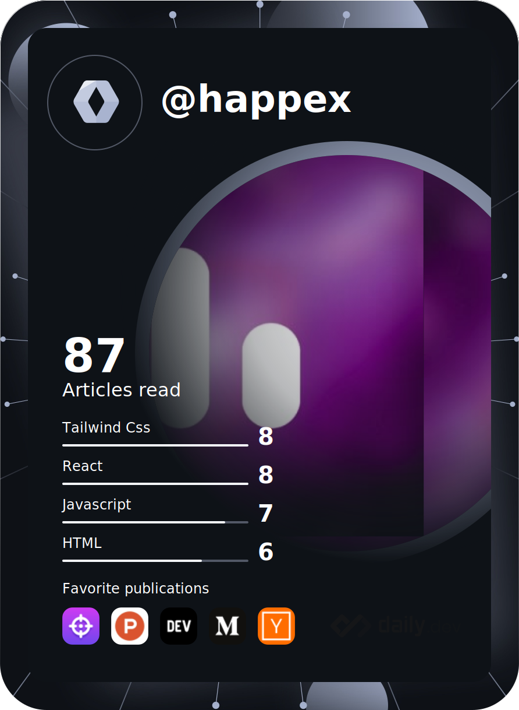

  
Hey! It's happex, a French boy in my teens. I've been programming for 7 years and I started web development 2 years ago.

My skills
-----
### Languages

### Tech stack
  
  

### Currently learning / Familiarizing with

My projects 
-----

* [The Game Hallows](https://gamehallows.pages.dev) - An open cross-platforms community (archived)
* [Geopen](https://geopen.vercel.app) - A brand new pen library on Scratch (archived)

My stats
-----

